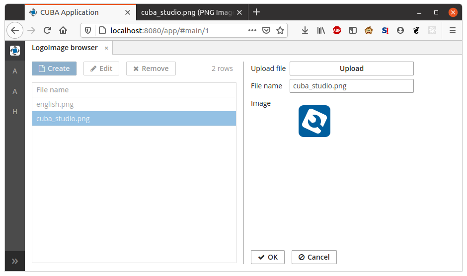
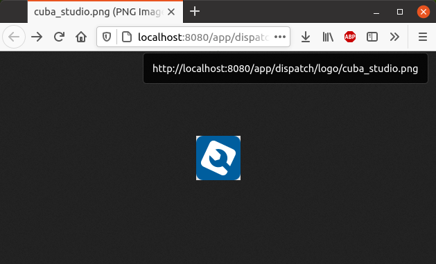

# Spring MVC public logo image sample

This sample demonstrates how to create publicly available Spring MVC controller in the web module of the CUBA project.

* MVC controller serves clients with publicly available logo images stored in the database.
* Logo images can be uploaded in the web client (Side Menu -> Application -> Logo Images).
* Controller URL: `http://localhost:8080/app/dispatch/logo/{FILE_NAME}`, e.g. `http://localhost:8080/app/dispatch/logo/cuba_studio.png`
* Images are requested without any authentication 
* Data is loaded under the `anonymous` user session using this user's permissions
* Implementation does not depend on the REST API addon

### Important code points

1) Data Model
- `com.sample.logos.entity.LogoImage` - JPA entity storing logo images (as byte array).

- `logo-image-browse.xml` - Logo image browser & editor screen.
  
2) Spring MVC
- `com/sample/logos/web-dispatcher-spring.xml` - add package for component scan where our MVC controllers will be located:
```
<context:component-scan base-package="com.sample.logos.web.controller"/>
```

- `com.sample.logos.web.controller.LogoController` - implementation of the Spring MVC controller.

- `com.sample.logos.web.controller.LogoController#withAnonymousUserSession(Callable)` - method to execute code block with permissions of the `anonymous` user.

- `web/WEB-INF/web.xml` - this is where `/dispatch/` part of the URL comes from.

3) Security settings

- `com.sample.logos.core.role.LogoReaderRole` - design-time role definition with permission to read `LogoImage` entities.

- `db/init/hsql/30.create-db.sql` - contains SQL statement to automatically assign `LogoReader` role to the `anonymous` user during database creation:
```
insert into SEC_USER_ROLE (ID, VERSION, USER_ID, ROLE_NAME)
values (newid(), 1, (select ID from SEC_USER where LOGIN = 'anonymous'), 'LogoReader');
```

### Screenshots




